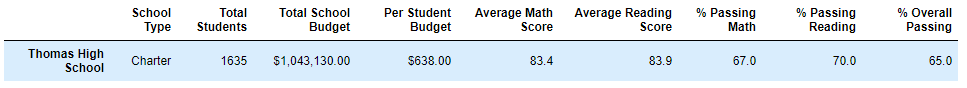

# School District Analysis

## Overview of the school district analysis

The purpose of this project is:
* To replace the math and reading scores for ninth grade Thomas High School with NaNs and rest of the data intact.
* To repeat the **School District Analysis** for the new data set.
* To compare the changes that affected the overall analysis with and without NaN value.

## Results

### 1. District Summary
There is no significant difference in the district summary with and without the reading and math scores of ninth grade Thomas High School.

* Math Average score is 79.0 in the district summary without NaNs and 78.9 in the district summary with NaNs. There is only a difference of 0.1.
* Rest of the scores and percentage are negligibly less in the district summary with NaNs.

*District Summary with all the scores:*

*District Summary without reading and math scores of ninth grade Thomas High School:*

### 2. School Summary

* The school summary of Thomas High School has changed from the original report.
* The percentage of math, reading and overall passing for Thomas High School has gone down after including NaNs for the ninth grade math and reading scores.
* The school summary of other schools remains the same.

**School Summary with all the scores:**

**School Summary without reading and math scores of ninth grade Thomas High School:**

### 3. Thomas High School performance

* The percentage of math, reading and overall passing for Thomas High School has gone down after including NaNs for the ninth grade math and reading scores.
* There is no significant change in the average math and reading scores.
* There is no change in the Per Student Budget.
* The percentage of math, reading and overall passing for Thomas High School looks same as original after considering only the students in tenth-twelfth grade for the total students were considered.

**Thomas High School Summary with all the scores:**

**Thomas High School Summary without reading and math scores of ninth grade:**

**Thomas High School Summary after considering only the scores of tenth-twelfth grade while calculating the math, reading and overall percentage:**

### 4. Affect of replacing the ninth-grade scores

#### Math and reading scores by grade

* The math and reading scores for the ninth grade Thomas High School shows **nan**, since it was replaced for all the students of ninth grade Thomas High School.
* There is no change in the math and reading scores of the students in the grade from tenth to twelfth of Thomas High School.
* There is no change in the math and reading scores of the students in other schools. They all remain the same.

**Math score by grade of original report:**

**Math score by grade of the report with NaNs for ninth grade Thomas High School:**

**Reading score by grade of original report:**

**Reading score by grade of the report with NaNs for ninth grade Thomas High School:**

#### Scores by school spending

* There is no difference between the scores of the students based on the spending range in the reports after replacing the ninth-grade scores of Thomas High School.
* The scores of the students decreases as the spending range per student increased.

**Scores by school spending of original report:**

**Scores by school spending of the report with NaNs for ninth grade Thomas High School:**

#### Scores by school size

* There is no difference between the scores of the students based on the school size in the reports after replacing the ninth-grade scores of Thomas High School.
* The scores of the students decreases as the size of the school increases.

**Scores by school size of original report:**

**Scores by school size of the report with NaNs for ninth grade Thomas High School:**

#### Scores by school type

* There is no difference between the scores of the students based on the school type in the reports after replacing the ninth-grade scores of Thomas High School.
* The students of *Charter School* have performed better than the students of *District School*.

**Scores by school type of original report:**

**Scores by school type of the report with NaNs for ninth grade Thomas High School:**

## Summary

The four major changes in the updated **School District Analysis** after reading and math scores of ninth grade at Thomas High School have been replaced with NaNs.
* In the school summary, the **% Passing Math**, **% Passing Reading** and **% Overall Passing** has dropped considerably for Thomas High School when the ninth grade student count is considered.
* There is only 0.1 score difference between the **Average Math Score** between the original and the updated school district analysis.
* There is no difference in the **Average Reading Score** between the original and the updated school district analysis, after rounding the score to the first decimal place.
* The percentage of **% Passing Math**, **% Passing Reading** and **% Overall Passing** for Thomas High School looks same as original after considering only the students in tenth-twelfth grade were considered for the total students.
